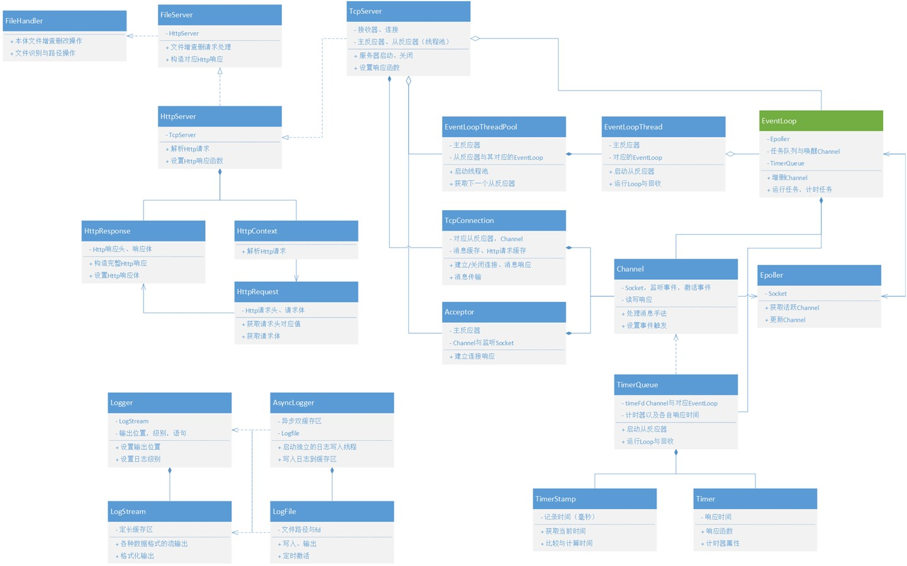

# SimpleFileServer - Http1.1 - Linux Cpp

A simple file server with http1.1 protocol. Not a high performance server, yet not a easy-to-use one. But still a pretty good choice for learning cpp and network programming.

UML:

## Part1: Tcp Connection

The core of processing Tcp Connection is the use of epoll, which is a very efficient way to handle multiple connections. The project used EventLoop, Channel, Epoller triangle to implement the epoll.

## Part2: Tcp Server

One Loop Per Thread model is used to handle multiple connections. Basically, the server have one main reactor loop and multiple sub reactor loops, controlled by a thread pool. The main reactor loop is used to accept new connections, and the sub reactor loops are used to handle the connections.

The TcpServer provide set_connection_callback and set_message_callback for you to realize your own callback for different connections.

## Part3: Http Parser

The project used HttpContext class to parse the http request. HttpContext parse the request line, headers, body and process a HttpRequest object. HttpResponse is used to generate the response.

## Part4: Http Server

The project used HttpServer class to handle the Http connections. HttpServer is responsible for creating the HttpContext object when new messages are in, and it is also responsible for generating the response.

The HttpServer class provide func set_http_callback for you to realize your own http callback for different requests.

## Part5: File Server

The project used FileServer class to handle GET/POST/PUT/DELETE requests. FileServer is responsible for reading the file using FileHandle class, and it is also responsible for generating the response. Range requests are supported.

No set_func is provided, so you have to change the code to realize your own http callback for different requests. This version is just a demo, and is not tested.

## Other Utils

Including Timer module, which is connected to the epoll with a channel listening the timeout event. Also including Log module, which is used to log the messages in async way or sync way.

## Acknowledgement

Thanks for the following projects:

[30daysCppWebServer] https://github.com/Wlgls/30daysCppWebServer

[30daysCppWebServer] https://github.com/yuesong-feng/30daysCppWebServer

[Muduo] https://github.com/chenshuo/muduo/

## Contribution

Feel free to contribute to the project.